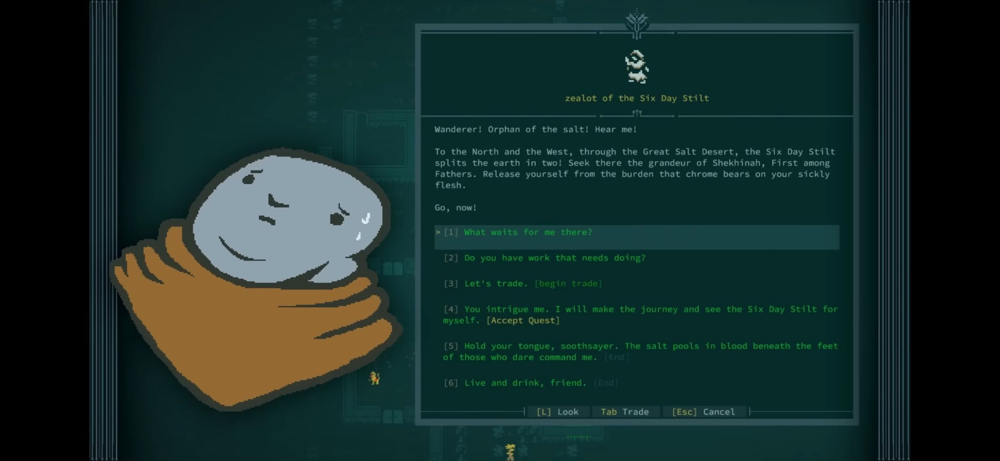

## Main

```sh
# Run server
npm run dev -w server

# Run client
npm run dev -w client
```

## Client/Server Model

Goal is to make `client` a Dockerfile and distribute a tiny shell script that pulls the latest docker image and then runs it. Roomies just have to install docker, download the script, and they're good to go.

### TODOs

TODO:
- https://www.npmjs.com/package/boxen for pretty boxes!
- features:
    - "ctrl c" to stop ai yapping
    - "editor" mode to edit last message/regenerate
    - save/export chat history
- client-side config/session storage
    - database for config/chat history
    - better support for copy/paste in client
    - better greeter page (print the actual commands)
    - implement more commands!

CLI vibe:


## TS

### Build/Run

(Assumes your `package.json` is set up)

```sh
# Alt syntax for using a runner, uses dev script definition in package.json
npm run dev

# Non-runner, compiles into dist/index.js, then runs compiled js
npm run build 
npm start
```

### Converting from NodeJS

##### 1. Install/init TS project

```sh
npm i --save-dev typescript
npm i --save-dev tsx

# Init typescript project with tsconfig.json
npx tsc --init
```

... then create `index.ts`

##### 2. Edit `package.json`:

Set values:

```json
{
    "main": "index.ts",
    "type": "module"
}
```

Add scripts:

```json
"scripts": {
    "build": "tsc",
    "dev": "tsx src/index.ts",
    "start": "node dist/index.js"
},
```

##### 3. Edit `tsconfig.json`

See my existing `tsconfig.json` for examples

## ollama

https://github.com/ollama/ollama

### Install docker image

https://hub.docker.com/r/ollama/ollama

```sh
# CPU only
sudo docker run -d -v ollama:/root/.ollama -p 11434:11434 --name ollama ollama/ollama
```

### Download a model

https://ollama.com/library?sort=popular

`sudo docker exec -it ollama ollama run smollm:latest`

### Query it from JS

```js
import ollama from 'ollama'

const message = { role: 'user', content: 'Why is the sky blue?' }
const response = await ollama.chat({
    model: 'smollm',
    messages: [message],
    stream: true,
})

for await (const part of response) {
    process.stdout.write(part.message.content)
}
```

### Helpful commands - Docker

```sh
# Manually start container (after reboot)
sudo docker start ollama

# List running containers
sudo docker ps

# List all images on the system
sudo docker ps -a
```

### Helpful commands - Ollama

```sh
# List downloaded models
sudo docker exec -it ollama ollama list

# List currently-loaded models
sudo docker exec -it ollama ollama ps

# Stop a currently-loaded model
sudo docker exec -it ollama ollama stop smollm
```